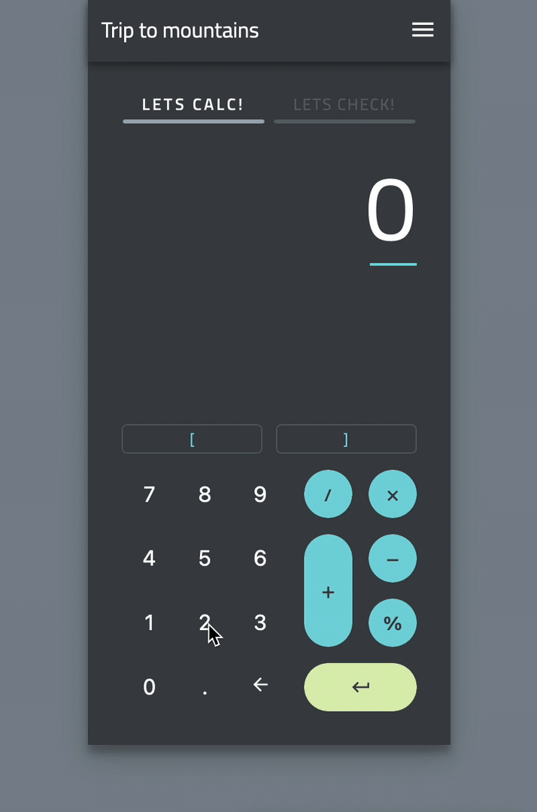

# Kalkulator z checklistą

Inteligentny kalkulator z checklistą?\
Granica między oszczędzaniem a wydawaniem jest krucha. Ale ile pieniędzy i na co tak naprawdę wydajemy?\
Z Intel. Kalkulatorem możesz ustalić swój budżet przyszłych wydatków, aby nic nie umknęło Twojej uwadze. Liczby są ważne, ale nadawanie znaczenia wydatkom jeszcze ważniejsze.\
Dzięki wbudowanej funkcji tekstowej z łatwością można dodać nazwy w różnych obszarach finansowych -zakupy, wakacje, samorozwój a może pasja?
To Ty wybierasz cel a przedstawiony kalkulator pomaga przejść tę drogę poprzez szacowanie wydatków.

Wdrożona aplikacja dostępna pod adresem: https://eager-murdock-da7cf8.netlify.app

## Użyte technologie:

<ul>
    <li>JavaScript - React</li>
    <li>CSS - Styled components</li>
    <li>mathjs</li>
    <li>Reduxjs/toolkit</li>
    <li>Redux thunk</li>
    <li>Firebase</li>
</ul>

## Podgląd aplikacji:

Inspiracja z [dribbble](https://dribbble.com/shots/6153949-Calculate-Check-Repeat)
